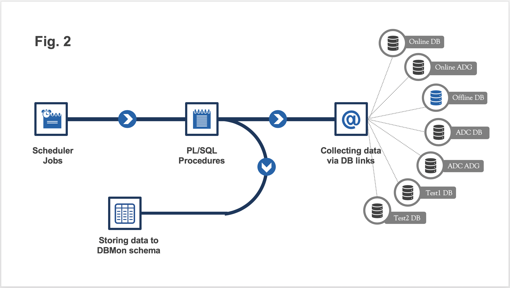

# Introduction

ATLAS Database & Application Monitoring is developed for the needs of the ATLAS DBAs and developers at CERN. The project's aim of ATLAS DBMon is to provide quick access to the key metrics of the monitored databases as well as to help developers know more about the application's queries and their effect on the database.

This repository is a complete copy of the original one, hosted at CERN GitLab, except for the specific data which was edited for security reasons.

https://gitlab.cern.ch/petya/dbmon-ords

## Implementation

There is one main Oracle DB schema (see fig. 1). Mostly all monitoring data is collected via database links from all other databases, then stored in tables in DBMON_SCHEMA (see fig 2). 
The API is using Oracle REST Data Servises(ORDS). It calls various PL/SQL functions to provide the data. The front-end is implemented with AngularJs (see fig 3). There is a GitLab CI configured which deploys automatically new versions of the application in OpenShift.

<figure>
  
  <figcaption text-align="center">Fig. 1</figcaption>
</figure>

<figure>
  
  <figcaption align="center">Fig. 2</figcaption>
</figure>

<figure>
  
  <figcaption align="center">Fig. 3</figcaption>
</figure>

## Authors

* **Gancho Dimitrov** - *Database designer* 
* **Andrea Formica** - *Author of the 1st version of the API* 
* **Benjamin Scheer** - *Migrated the old API to Oracle REST Data Servises(ORDS)* 
* **Petya Vasileva** - *Primary developer* 
